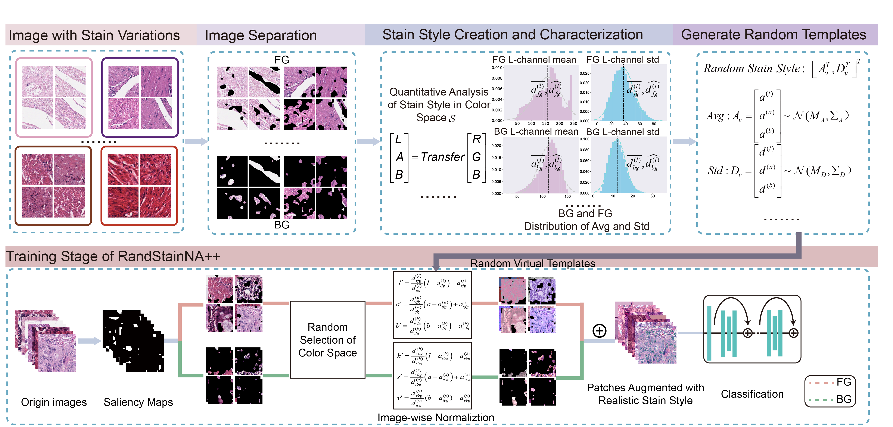

# RandStainNA++

Implementation for the paper: "RandStainNA++: Enhance Random Stain Augmentation and Normalization through Foreground and Background Differentiation“

Paper link: https://arxiv.org/abs/2206.12694

## 1. Method Overview



RandStainNA++ is a augmentation scheme to train a stain agnostic deep learning model specifically for **digital pathology** analysis. 


## 2. Code Organizations
The codes are organized as follows:
- `randstainna`: provides the visualization of stain normalizations, stain augmentations, and RandStainNA.
- `preprocess`: perform the statistics in the pre-processing stage. Results should be presented as fg/[`CRC_LAB_randomTrue_n0.yaml`](./CRC_LAB_randomTrue_n0.yaml).
- 


## 3. Set Up the Environmets
Run 
```
pip install -r requirements.txt
```
to install the required libraries. 

## 4. Use RandStainNA++

```
bash scripts_attention/0_scripts_attention.sh
```

